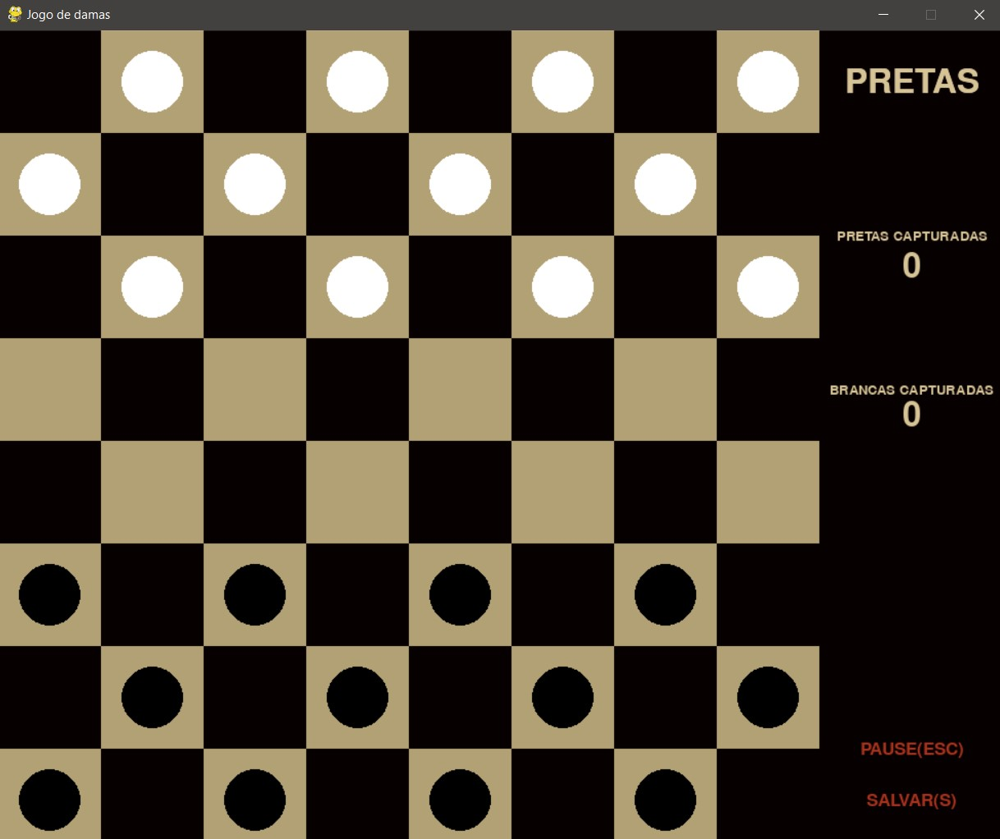

# Jogo de Damas com Inteligência Artificial

Este projeto tem como objetivo desenvolver um jogo de Damas em que um jogador humano possa jogar contra uma inteligência artificial. A aplicação foi implementada em Python, utilizando a biblioteca Pygame para criar uma interface gráfica intuitiva e amigável.

# MENU

# TABULEIRO

## Funcionalidades

A aplicação conta com as seguintes funcionalidades:

- **Iniciar um novo jogo SEM Análise da IA:** O jogador pode iniciar uma nova partida de Damas comum a qualquer momento.
- **Iniciar um novo jogo COM Análise da IA:** O jogador inicia uma partida de Damas, onde serão mostradas em tempo real todas as análises que a Inteligência Artificial realizou por meio da árvore de decisão antes de escolher a melhor jogada e movimentar a peça.
- **Salvar e recuperar jogo:** É possível interromper o jogo atual e salvá-lo para continuar posteriormente a partir do ponto em que parou.
- **Informações do jogo:** O jogador pode visualizar informações importantes, como a vez do jogador atual, a quantidade de peças capturadas por cada jogador e quais peças são "damas".
- **Gravação de jogos:** A sequência de movimentos de um jogo pode ser gravada para posterior recuperação e análise.

## Interface intuitiva

A interface gráfica foi projetada para ser intuitiva e de fácil uso. O jogador pode interagir com o jogo por meio de cliques e movimentos do mouse. Os menus são claros e apresentam opções como iniciar uma nova partida, salvar o jogo atual ou fechar o jogo.

## Inteligência Artificial

O destaque deste projeto é a presença de uma inteligência artificial que joga como o adversário do jogador humano. A IA foi desenvolvida para escolher a melhor jogada possível a cada momento, buscando maximizar suas chances de vitória. Ela utiliza uma estratégia de busca com uma profundidade de decisão de 2, o que permite uma tomada de decisão mais inteligente e estratégica.

## Colaboradores

Este projeto foi desenvolvido em colaboração por <a href="https://github.com/isabela-code"> Isabela de Queiroz</a>, Mateus Ribeiro e <a href="https://github.com/FafizDev"> Fabricio Silva </a>. Cada membro contribuiu com suas habilidades e conhecimentos para tornar este jogo de Damas com inteligência artificial uma realidade.

## Como executar o jogo

Para executar o jogo, é necessário ter o Python instalado juntamente com a biblioteca Pygame. Após a instalação, basta rodar o arquivo principal do jogo e a interface gráfica será aberta, permitindo que o jogador humano comece a jogar contra a inteligência artificial.

## Considerações finais

Este projeto combina diversão e desafio ao trazer um jogo de Damas com uma inteligência artificial como adversário. A interface gráfica amigável, as funcionalidades completas e a estratégia inteligente da IA proporcionam uma experiência de jogo envolvente. Divirta-se jogando Damas contra o computador!
